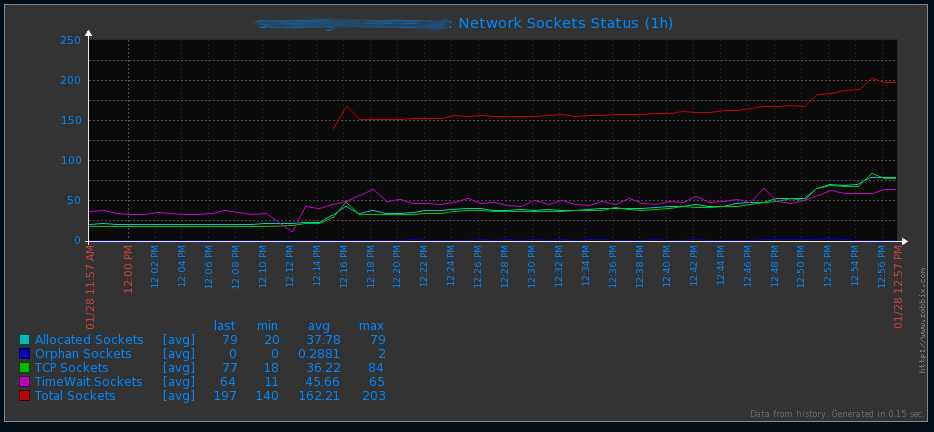

sockstat-zabbix-template
=====================

Description
-----------

Zabbix 2.2 comes with support of loadable modules for extending Zabbix agent and server without sacrificing performance.

A loadable module is basically a shared library used by Zabbix server or agent and loaded on startup. The library should contain certain functions, so that a Zabbix process may detect that the file is indeed a module it can load and work with.

Loadable modules have a number of benefits. Great performance and ability to implement any logic are very important, but perhaps the most important advantage is the ability to develop, use and share Zabbix modules. It contributes to trouble-free maintenance and helps to deliver new functionality easier and independently of the Zabbix core code base.

I have created a agent module to parse the */proc/net/sockstat* info for Zabbix > 2.2.x
You will be able to watch the *orphan* sockets or the *timewait* sockets. They are interesting for: DDOS detection, leaks in webapps services etc etc...


Install
-------

From **CentOS**: `yum install <url_to_rpm>` just that.

From **source**:

You need to download the Zabbix 2.2.x source and:

```
cd <source_zabbix>
./configure
make

cd <source_zabbix>/src/modules/ 
```

and you should create a new directory with this git repo content. After that, inside of the new module directory, a `make` is enough.

**Other**: There is a compiled version too. Copy it wherever you want.


Configure
---------

**CentOS RPM:* Nothing. RPM does it.


**No CentOS:** `cd /etc/zabbix/zabbix_agentd.conf`

```
LoadModulePath=/etc/zabbix/modules
LoadModule=zbx_sockstat.so
```

At the moment I only have implemented 5 keys:

```
[root@build zbx_sockstat]# zabbix_agentd -t sockstat.info[total]
sockstat.info[total]                          [u|991]
[root@build zbx_sockstat]# zabbix_agentd -t sockstat.info[tcp]
sockstat.info[tcp]                            [u|6]
[root@build zbx_sockstat]# zabbix_agentd -t sockstat.info[orphan]
sockstat.info[orphan]                         [u|0]
[root@build zbx_sockstat]# zabbix_agentd -t sockstat.info[timewait]
sockstat.info[timewait]                       [u|135]
[root@build zbx_sockstat]# zabbix_agentd -t sockstat.info[allocated]
sockstat.info[allocated]                      [u|64]
```
I got the info from here:

```
[root@build zbx_sockstat]# cat  /proc/net/sockstat
sockets: used 991
TCP: inuse 6 orphan 0 tw 135 alloc 64 mem 3
UDP: inuse 0 mem 1
UDPLITE: inuse 0
RAW: inuse 0
FRAG: inuse 0 memory 0
```

Zabbix 2.2.x template
---------------------

There is a xml file (zabbix_template/) to import in Zabbix server with:

* 5 items
* 1 graph

Screenshots
-----------



Environment
-----------

I am using this module with:

* CentOS 6.5
* Kernel: 2.6.32-431.3.1.el6.x86_64
* Zabbix 2.2.x

Notes
-----

I am not a developer. I am a sysadmin. Sorry for my bad programming practices etc etc ......
